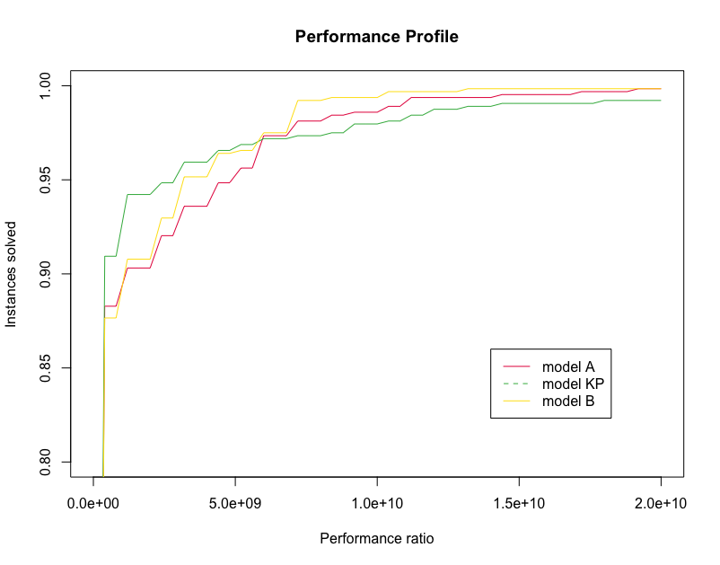

# R Performance Profile

R library to plot performance profiles

STATE : UNDER DEVELOPMENT (starting to begin to think about ideas about this project)

## Example of performance profile


## Sources
- http://abelsiqueira.github.io/blog/introduction-to-performance-profile/

## Example
```
setwd("~/Documents/r/r-performance-profile")
source("./library/mincost.R")
source("./library/rcost.R")
source("./library/plot.perf.R")

COLUMNS = c("instance", "n_jobs", "n_occurrences", "model", "status", "obj", "time")
results = read.csv("./example-data/results.csv", sep=";", header=FALSE, col.names=COLUMNS)

plot.perf(results,
          algorithm.col = "model",
          acost.col = "time",
          n = 50,
          ylim = c(.8, 1),
          xlim = c(0, 2e+10),
          legend = c("model A", "model KP", "model B")
        )

```