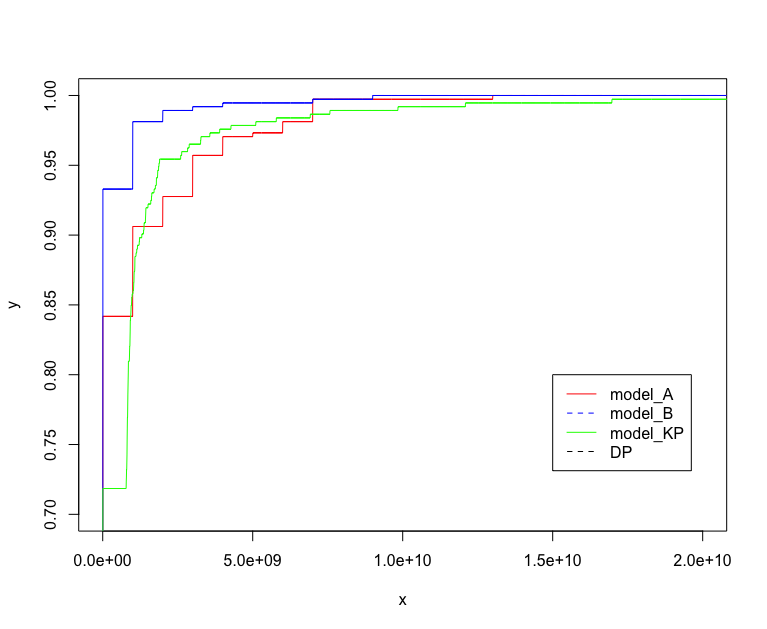

# R Performance Profile

R library to plot performance profiles

STATE : UNDER DEVELOPMENT (starting to begin to think about ideas about this project)

## Example of performance profile


## Sources
- http://abelsiqueira.github.io/blog/introduction-to-performance-profile/

## Early documentation
```
rcost(data =, instance.col =, algorithm.col =)

perf(rcost =, eps =)
perf(data =, instance.col =, algorithm.col =, eps =)

plot.perf(perf =, col =)
plot.perf(rcost =, eps =, col =)
plot.perf(data =, instance.col =, algorithm.col =, col =)
# title, legend, window.x, window.y
```